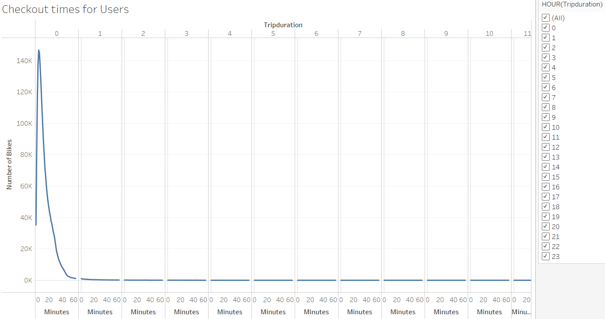
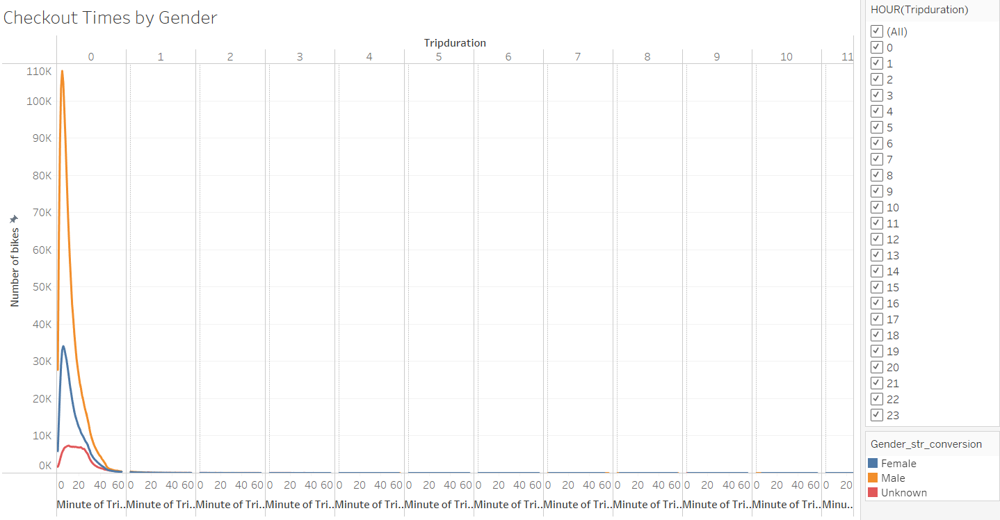
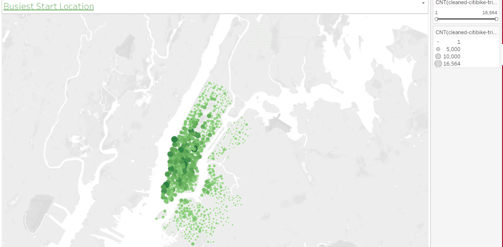
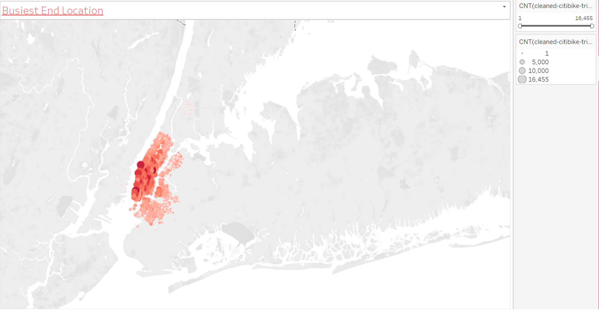

# bike_sharing

**Overview of the analysis:**

I am analyzing NYC “Citi bike” data, This is a successful bike sharing company, analyzing this data will give some insight whether similar business will be successful in Des Moines ,Iowa. I have created charts and dashboard to present to potential investors.

**Purpose of this analysis:**

Tableau is an excellent tool for data visualization, in this analysis created the following charts

1.I have compared the trip duration and number of bikes used based on every hour of the day using a line chart, This information helps if we get investor to start this bike sharing in Des Moines we will know the busy hours , How many bikes we need to stock to meet customer demands.

2.The second chart shows the same information with gender breakdown, This allow us to identify potential growth prospects and what we can do to attract more female riders.

3.Limitations of this analysis :Resident population in Des Moines IA as of 2021 is 216,594 (google data) , compared to the population of Newyork city in 2021 that is 8.82 Million , Out of 8.82 Million people 2.34 million people are willing to use bikes for commutes, we can not say the same for Des Moines IA as its population is much smaller and tourists visits are also very less compared to NYC. 

**Results:** 

Following are some of the chart images from the analysis.

Here are the links to Dashboards and story:

[link to Story](https://public.tableau.com/app/profile/sangeetha.venu.gopalan/viz/Mod14_Challenge_16395063197060/NYCbikesharestory)

[link to Dashboard1](https://public.tableau.com/app/profile/sangeetha.venu.gopalan/viz/Mod14_Challenge_Db1/DB1)

[link to Dashboard2](https://public.tableau.com/app/profile/sangeetha.venu.gopalan/viz/Mod14_Challenge_Db2/DB2)